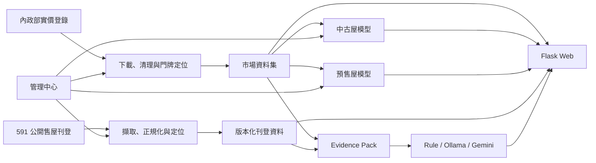

# 青埔智價 Qingpu Insight

青埔智價是一個聚焦桃園機場捷運 A17～A19 生活圈的本機房價分析產品。它把官方實價登錄、591 公開售屋刊登、機器學習估價、可追溯的 AI 買方報告，以及資料與模型維運整合在同一個 Flask Web 介面。

這不是全台房仲平台，也不預測未來房價。專案的目標是示範一條可檢查、可重現、可回滾的資料與 AI 產品流程。

> 本工具僅供資料分析、課程展示與購屋研究，不構成正式不動產鑑價、投資建議或未來價格預測。

## 專案定位

- **AIPE04 期中專題**：展示資料工程、機器學習、MySQL、Web 與生成式 AI 的整合。
- **求職作品集**：呈現從資料取得、品質控制、模型評估到本機產品化與維運的完整 Python 專案。
- **自用分析工具**：查詢青埔市場、比較刊登開價、進行條件估價並產生單一物件買方報告。

## 可以做什麼

| 功能 | 使用者看到的結果 |
|------|------------------|
| 市場分析 | A17～A19 成交摘要、價格趨勢、交易量、近期成交與互動地圖 |
| AI 條件估價 | 中古屋／預售屋估計總價、合理區間、可信度、影響因素與相似成交 |
| 刊登情報 | 591 中古屋與預售屋最新刊登、價格異動及開價比較 |
| 智慧購屋報告 | 以 Evidence Pack 與 fact ID 約束 Rule／Ollama／Gemini 的單一物件報告 |
| 模型觀測台 | 查看候選模型、MAE、MAPE、R²、回溯測試與發布資格 |
| 管理中心 | 在前端操作官方資料更新、591 更新、模型訓練、發布、回滾、備份與診斷 |

主要頁面：

- 產品首頁：<http://127.0.0.1:5000/>
- 管理中心：<http://127.0.0.1:5000/admin>
- 模型觀測台：<http://127.0.0.1:5000/admin#models>

管理端只接受本機 `127.0.0.1`／`localhost` 存取。

## 系統架構



核心設計：

- 中古屋與預售屋分開清理、評估及建模。
- 591 刊登價不會混入官方成交價，也不會成為模型訓練標籤。
- 模型負責數值估價；LLM 只整理已驗證的 Evidence Pack。
- 訓練只建立候選模型，不會自動覆蓋正式模型。
- 資料與模型發布採版本化流程，失敗時保留上一個可用版本。

## 技術棧

| 層級 | 技術 |
|------|------|
| 資料處理 | Python 3.11、Pandas、NumPy、PyArrow |
| 地理處理 | 桃園門牌資料、PyProj、A17～A19 兩公里生活圈 |
| 機器學習 | scikit-learn、Ridge、Random Forest、HistGradientBoosting |
| Web | Flask、原生 JavaScript、Leaflet |
| 資料庫 | MySQL 8、PyMySQL、版本化 staging／publish |
| 爬蟲 | Selenium、Beautiful Soup、可見 Chrome |
| AI 報告 | Rule Provider、Ollama、Gemini、Pydantic schema validation |
| 品質 | Pytest、Ruff、模型發布閘門、備份還原演練 |

## 五分鐘啟動

### 1. 前置需求

- Windows 10／11
- **Python 3.11**
- Chrome；只有更新 591 刊登時需要
- MySQL 8；只有管理工作、版本發布、備份與完整報告流程需要

公開儲存庫不包含資料集、模型、備份、密鑰、Cookie 或 591 原始 HTML。新 clone 可以檢查程式與執行測試，但必須先建立本機資料與模型，才能看到完整產品內容。

### 2. 建立環境

```powershell
git clone https://github.com/hh123456tw/qingpu-insight.git
cd qingpu-insight
py -3.11 -m venv .venv
.\.venv\Scripts\python.exe -m pip install -e ".[dev]"
```

如果專案已有 `.venv`，不要用另一個 Python 版本直接覆寫。NumPy 顯示 `cp311`／`cp312` 不相容時，請關閉正在使用虛擬環境的程式，再以同一版 Python 乾淨重建。

### 3. 啟動既有本機成果

如果 `data/processed/` 已有處理後資料，且 `artifacts/` 已有正式模型：

```powershell
.\.venv\Scripts\qingpu-web.exe
```

開啟 <http://127.0.0.1:5000/>。未設定 MySQL 時，Web 會使用本機 Parquet 相容路徑；需要寫入或發布的管理功能會保持停用並說明原因。

### 4. 從官方資料建立成果

第一次執行或公開 clone 尚無本機資料時：

```powershell
.\.venv\Scripts\qingpu-data.exe run --start-season 110S3 --end-season 115S2
.\.venv\Scripts\qingpu-data.exe market-build
.\.venv\Scripts\qingpu-data.exe model-train
.\.venv\Scripts\qingpu-web.exe
```

完成首次資料與模型建立後，日常更新、訓練與發布可以改由管理中心操作。

## 管理中心

管理中心將操作依目的分類，避免使用者背誦 CLI：

| 分類 | 功能 |
|------|------|
| 總覽 | 系統狀態、可用功能、待處理事項 |
| 資料 | 指定季度範圍，一鍵更新官方資料 |
| 刊登 | 依序更新 591 中古屋與預售屋 |
| 模型 | 調參訓練、候選比較、發布預覽、發布與回滾 |
| LLM | Gemini Key、Provider smoke test、固定案例 benchmark |
| 備份 | 建立備份、隔離還原演練、受保護的正式還原 |
| 工作 | 背景工作進度、歷史、輸出與安全錯誤摘要 |
| 診斷 | 目前環境、資料及服務狀態 |

### 完整管理功能的必要設定

```powershell
$env:QINGPU_DATABASE_URL = "mysql+pymysql://<user>:<url-encoded-password>@127.0.0.1:3306/<database>"
$env:QINGPU_SECRET_KEY = "<至少 32 字元的本機隨機密鑰>"
$env:QINGPU_DEBUG = "0"
.\.venv\Scripts\qingpu-web.exe
```

`QINGPU_SECRET_KEY` 必須符合強度政策。真實連線字串與密鑰只放在本機環境，不要提交到 Git。

## 資料範圍

### 官方成交資料

- 內政部不動產交易實價登錄
- 桃園市官方門牌資料
- 桃園機場捷運 A17、A18、A19 車站資料
- 只納入通過住宅、價格、面積、日期與兩公里生活圈規則的交易

### 591 公開刊登

Web 主流程只處理：

1. `sale`：中古屋／成屋出售
2. `newhouse`：預售屋／新成屋出售

租屋資料不屬於本專題的市場估價與前端維運主線。舊版相容程式可能仍保留 rental 的底層契約，但管理介面不會抓取、發布或展示租屋流程。

系統使用可見 Chrome，不繞過驗證，也不刻意收集帳號、密碼、Cookie 或聯絡欄位。原始 HTML 只保留在本機忽略路徑。

## 地圖與近期成交不是同一個上限

- 成交地圖使用目前篩選條件下的全部有效座標資料。
- 為避免瀏覽器一次繪製上萬個 marker，後端依縮放層級聚合為最多 500 個地圖群組。
- 地圖狀態會顯示總交易、有座標與未定位筆數。
- 「近期成交」表格獨立顯示最新 100 筆；它不代表地圖或市場統計只有 100 筆。
- 地圖與其他首頁模組分開更新，單一摘要 API 失敗不應讓底圖或成交點一起消失。

## 模型與評估

### 為什麼沒有使用 XGBoost

目前候選模型為 Ridge、Random Forest 與 HistGradientBoosting，另以 RecentMedianBaseline 作為比較基準。此專案資料量為數千至一萬多筆，scikit-learn 的 HistGradientBoosting 已能提供合適表現，也能減少額外套件與部署複雜度。模型選擇由實際時間切割結果決定，不因工具熱門程度決定。

### 訓練策略

- 訓練、校準與測試依時間順序切割，不隨機打散未來交易。
- 中古屋使用近期交易權重，預設半衰期為 48 個月。
- 中古屋加入交易月份、站點×建物類型、屋齡帶、坪數帶與樓層帶等衍生特徵。
- Web 提供快速、平衡、精細三組固定 profile，也可加入一組受範圍限制的自訂 profile。
- 每次訓練產生 immutable candidate，不直接覆蓋正式 artifact。

### 指標怎麼看

| 指標 | 白話說明 | 判讀方向 |
|------|----------|----------|
| MAE | 平均每坪估錯多少元 | 越低越好 |
| MAPE | 平均百分比誤差 | 越低越好，適合跨價位理解 |
| R² | 模型解釋價格差異的程度 | 越高越好，但不能單獨判斷模型 |
| Coverage | 真實價格落在估價區間內的比例 | 越高代表區間較常涵蓋真值 |
| Baseline delta | 候選模型相對近期中位數改善多少 | 正向改善才值得考慮發布 |

### 發布閘門

中古屋候選模型必須同時通過整體 MAE、各站 MAPE、A18 不倒退、年度回溯及資料新鮮度檢查，管理端才會標記為建議發布。發布前可展開查看：

- 訓練資料範圍與筆數
- 使用的 profile 與超參數
- 候選模型和 baseline 指標
- A17／A18／A19 分站結果
- 三次年度回溯測試
- 每一項發布資格及失敗原因

正式模型資料超過 180 天時，估價會降級為近期中位數基準、放寬區間並將可信度設為低，不會假裝舊模型仍可靠。

完整定義請見 [AI 估價方法論](docs/m2-valuation-methodology.md)。

## 可追溯 AI 報告

買方報告一次只分析一個刊登物件。系統先把成交、估價與刊登資訊整理成 Evidence Pack，每個數字都有 fact ID。Rule、Ollama 或 Gemini 只能引用已存在的 fact；schema 或 evidence validation 失敗時，報告不會被判定成功。

- **Rule**：完全離線，不需要 LLM，適合展示 smoke test 與規則式報告。
- **Ollama**：選用的本機模型。
- **Gemini**：選用的外部 Provider；API Key 可由管理介面存入不提交 Git 的 `instance/secrets.env`。

LLM 不是資料清理、刊登發布或模型估價的必要條件。

## 測試與驗證

```powershell
.\.venv\Scripts\python.exe -m pytest -q
.\.venv\Scripts\python.exe -m ruff check .
.\.venv\Scripts\qingpu-data.exe llm-smoke --provider rule --model rule --output-dir outputs/m44-benchmark
```

自動測試涵蓋資料契約、模型特徵、時間切割、發布閘門、API、安全限制、前端 JavaScript 契約與失敗回滾。真實 MySQL、可見 Chrome、591 頁面及選用 LLM Provider 仍需在展示電腦進行人工 smoke test。

## 公開儲存庫邊界

以下內容不提交 Git：

- `.env`、`instance/secrets.env` 與任何 API Key
- `data/raw/`、`data/processed/` 與 Parquet 資料集
- `artifacts/` 內的模型
- `outputs/backups/` 與執行輸出
- 591 原始 HTML、Chrome profile、Cookie 與聯絡資訊

因此，公開 clone 的首頁可能沒有資料點或正式模型。這代表本機 runtime artifact 尚未建立，不代表前端故障。

## 詳細文件

| 文件 | 內容 |
|------|------|
| [M1 市場資料方法論](docs/m1-market-methodology.md) | 住宅篩選、生活圈、定位與市場指標 |
| [M2 AI 估價方法論](docs/m2-valuation-methodology.md) | 特徵、調參、時間切割、指標與模型限制 |
| [M3 刊登方法論](docs/m3-listing-methodology.md) | 591 擷取、批次、事件與隱私邊界 |
| [M4 刊登定位方法論](docs/m4-location-methodology.md) | 地址證據、定位信心與發布控制 |

CLI 的實際參數以程式內說明為準：

```powershell
.\.venv\Scripts\qingpu-data.exe --help
```

## 已知限制

- 僅涵蓋 A17～A19 兩公里生活圈，不代表桃園或全台市場。
- 模型估計目前合理價格，不預測未來漲跌。
- 未納入利率、政策、景觀、裝潢與建商品牌等難以穩定量化的特徵。
- 591 頁面結構或驗證流程變更時，擷取可能需要人工處理或程式更新。
- 座標不足的交易或刊登會保留為未定位，不以標題或地標猜測位置。
- 本機管理中心不是多使用者 SaaS，也沒有公開雲端部署目標。

## 面試時值得說明的設計決策

1. 為什麼中古屋與預售屋必須分開建模。
2. 為什麼模型評估必須使用時間切割。
3. 為什麼訓練與發布是兩個獨立步驟。
4. 為什麼 LLM 只能引用 Evidence Pack 的 fact ID。
5. 如何用 immutable artifact、版本發布、health check 與 restore drill 降低更新風險。

專案網址：<https://github.com/hh123456tw/qingpu-insight>
