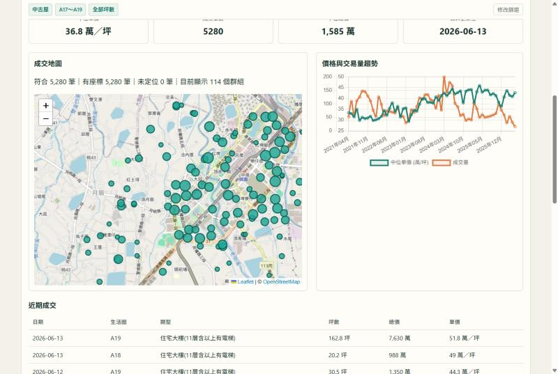
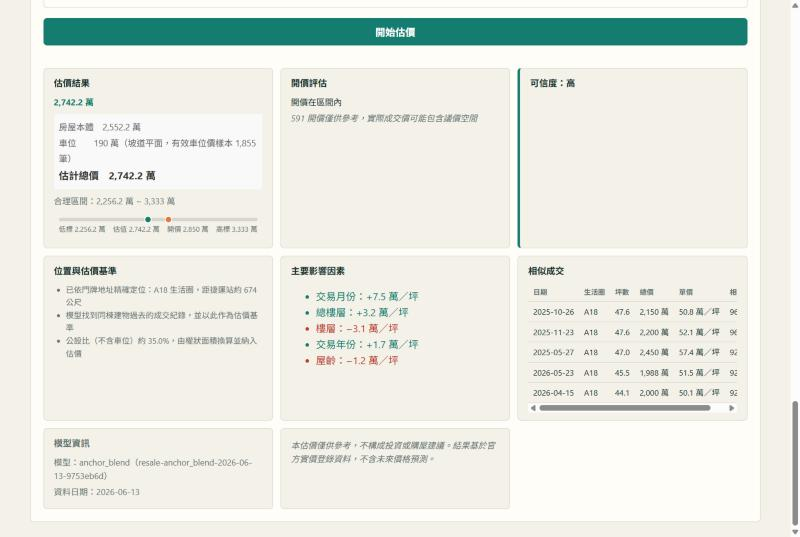
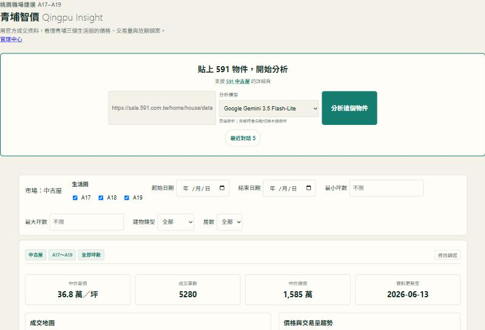
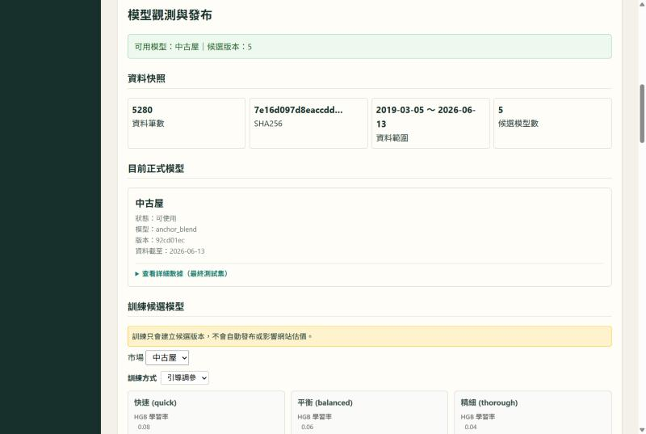
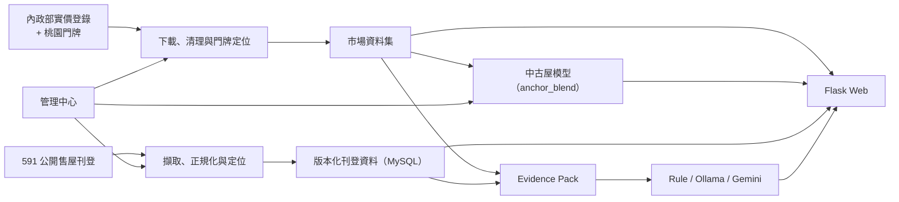

# 青埔智價 Qingpu Insight

青埔智價是一個聚焦桃園機場捷運 A17～A19 生活圈的**本機中古屋估價與市場分析工具**。它把官方實價登錄、591 公開售屋刊登、機器學習估價、可追溯的 AI 買方報告，以及資料與模型維運整合在同一個 Flask Web 介面（Python 3.11、scikit-learn、原生 JavaScript、選用 MySQL 8）。

這不是全台房仲平台，也不預測未來房價。專案的目標是示範一條可檢查、可重現、可回滾的資料與 AI 產品流程。

> 本工具僅供資料分析、課程展示與購屋研究，不構成正式不動產鑑價、投資建議或未來價格預測。591 刊登價包含議價空間，不代表成交價；AI 回答只能引用系統已驗證的證據，但仍可能有誤，請自行查證。

> **公開產品範圍：只支援中古屋（`resale`）。** 預售屋（`presale`）底層官方資料保留作為資料沿革與研究素材，但不進入公開市場指標、估價、模型訓練、模型發布或 591 物件入口。

## 成果與限制

**做什麼**：輸入 A17～A19 生活圈中古屋的門牌地址（或站點與距捷運距離）、坪數、屋齡、樓層、格局，以及選填的權狀面積（主建物／附屬建物／陽台）與車位，回傳總價與每坪單價估值、90% 區間、可信度與相似成交；也能貼上 591 中古屋網址，讓 LLM 依據已驗證的證據（fact ID）回答問題。

**目前正式模型**：版本 `92cd01ec`（候選 `5795c230`），同棟價格錨點混合模型（`anchor_blend`：兩個 HistGradientBoosting 在對數空間平均，其中一個以同棟完工前／預售／過去成交價為錨點），特徵含選填的公設比，90% 區間直接在**總價**上校準。以 5,280 筆清理後的中古屋成交建立時間切割（訓練 4,276／校準 380／測試 624）。

以下為 final test（2025-06-14～2026-06-13，n=624，訓練時沒看過的最後 12 個月），以**總價 MAPE** 比較（車位目標值定義修正後，單價 MAPE 無法跨版本比較）：

| Final test 總價 | 正式 `92cd01ec` | 前一版 `ad50841d` | 近期中位數基準線 |
|------|------|------|------|
| MAPE（全部） | **16.83%** | 18.94% | 25.20% |
| Median APE | **7.74%** | — | 14.48% |
| PPE10（誤差 ±10% 內的比例） | **57.2%** | — | 34.3% |
| A17／A18／A19 MAPE | **8.66%／21.49%／10.01%** | 9.6%／24.3%／11.1% | 27.1%／27.5%／19.8% |
| 90% 區間實際覆蓋率 | 79.0%（總價校準） | 77.6%（單價校準） | — |

- 依錨點來源分組：有同棟中古屋成交歷史的物件（n=262）總價 MAPE 8.99%；主要依同棟完工前移轉推估（多為新建案，n=329）為 23.53%。
- 90% 區間在 final test **低於名目 90%**；扣除水源南路建案後約 91～92%（§20 事前登記實驗）。回測中總價覆蓋率約 90%。
- 發布依據、實驗設計與每項候選特徵的取捨見[問題紀錄 §18～§20](docs/project-issue-log.md) 與[改善路線圖](docs/improvement-roadmap.md)。

**主要限制**

- **新建案會被以預售價等級估價**：大園區水源南路一個 2025 年完工的新華廈建案（final test 92 筆）以接近預售價轉手，模型依歷史「新建案轉手高於預售價」而高估，該建案總價誤差約 70%（§20 實驗），是 A18 與整體誤差的最大來源。屋齡 2 年內、主要依完工前成交推估的估價會加註說明，可信度最高為中。
- **首頁須填門牌地址才能使用同棟錨點**：未填地址時只能依生活圈與距捷運距離估價，誤差明顯較大。
- **591 公設比換算建立在未驗證的假設上**：假設 591 的「附屬建物」已含陽台，且 591 標示的公設比含車位；兩者都沒有以權狀逐筆驗證。
- **只支援 Windows**：`listing_update.py` 以 `msvcrt` 做檔案鎖，`qingpu-web` 與 `qingpu-data` 都會匯入它，在 macOS／Linux 無法啟動。
- 只涵蓋 A17～A19 兩公里生活圈，模型估計目前合理價格，不預測漲跌；上漲期樹模型無法外推，回測各窗口平均低估 2～9%。

**資料污染案例**：更早的正式模型 `57cf2ba9` 的 MAE 4.24 萬／坪、R² 0.775 來自預售移轉混入中古屋的污染資料，並非真實能力。追查過程、重現方式與修正決策見[問題紀錄 §16、§18](docs/project-issue-log.md)，改用同棟錨點的過程見 §19。

## 畫面截圖

| 市場分析 | AI 條件估價 |
|---|---|
|  |  |
| **首頁與 591 物件助理** | **管理中心：模型觀測與發布** |
|  |  |

估價截圖以一筆公開實價登錄成交（A18、2 樓、房屋 48.49 坪（不含車位）＋車位 9.57 坪、實際成交 2,850 萬）示範：模型估 2,742 萬、合理區間 2,256～3,333 萬，並以門牌定位到同棟歷史成交作為錨點。

## 功能

| 功能 | 使用者看到的結果 |
|------|------------------|
| 市場分析 | A17～A19 中古屋成交摘要、價格趨勢、交易量、近期成交與互動地圖 |
| AI 條件估價 | 總價與單價估值、90% 區間、可信度、影響因素、相似成交與開價評估 |
| 591 物件助理 | 貼入中古屋詳細頁 → 秒回初始摘要 → 持續對話，回答附驗證證據 |
| 買方報告 | 後端保留完整報告 API 與 CLI；首頁不顯示報告表單 |
| 管理中心 | 資料更新、591 刊登更新、模型訓練／發布／回滾、LLM Benchmark、健康檢查與備份 |

- 產品首頁：<http://127.0.0.1:5000/>（由上而下：591 物件助理、市場分析、AI 條件估價）
- 管理中心：<http://127.0.0.1:5000/admin/>、模型頁 <http://127.0.0.1:5000/admin/models>（只接受本機存取）

## 快速開始

### 1. 前置需求

- **Windows 10／11**（見「主要限制」）
- **Python 3.11**
- Node.js；只有執行前端 JavaScript 契約測試時需要
- Chrome；更新 591 刊登或分析 591 詳細頁時需要
- MySQL 8；選用。591 物件助理、模型訓練、管理中心寫入／發布、備份與報告需要
- Gemini API Key；選用。未設定時可用 Rule 或本機 Ollama

公開儲存庫**不包含**資料集、備份、密鑰、Cookie 或 591 原始 HTML，但**包含目前的正式中古屋模型**（`artifacts/official/resale/current.json` 指向 `versions/92cd01ec/`，另保留上一版 `ad50841d` 作為回滾目標）。新 clone 不必訓練模型，只要下載官方資料並建立市場資料集，就能使用市場分析與 AI 條件估價。

| 功能 | 只有 Parquet | 需要 MySQL | 需要 Gemini |
|------|:---:|:---:|:---:|
| 市場分析、成交地圖、AI 條件估價 | ✓ | | |
| 591 物件助理（對話） | | ✓ | 選用（否則用 Rule／Ollama） |
| 模型訓練、發布、回滾、管理中心寫入操作 | | ✓（另需強度足夠的 `QINGPU_SECRET_KEY`） | |
| 買方報告、健康檢查、備份 | | ✓ | 選用 |

### 2. 建立環境

```powershell
git clone https://github.com/hh123456tw/qingpu-insight.git
cd qingpu-insight
py -3.11 -m venv .venv
.\.venv\Scripts\python.exe -m pip install -e ".[dev]"
Copy-Item .env.example .env   # 選用：未填的功能會自動停用
```

若看到 NumPy C-extension 的 `cp311`／`cp312` 不相容訊息，代表 `.venv` 曾被另一個 Python 版本覆寫；關閉使用中的程式後刪除 `.venv`，再以 Python 3.11 乾淨重建。看到 `No module named 'dotenv'` 代表依賴沒有重新安裝，重跑上面的 `pip install` 即可。

### 3. 建立市場資料（第一次必做）

```powershell
# 下載 110S3～115S2 官方成交資料與桃園門牌，並完成地址定位（= acquire + analyse，需要網路）
.\.venv\Scripts\qingpu-data.exe run --start-season 110S3 --end-season 115S2

# 清理成市場資料集 data/processed/market_transactions.parquet（首頁與估價讀取此檔，可離線）
.\.venv\Scripts\qingpu-data.exe market-build
```

`run` **不會**自動執行 `market-build`；少了第二步首頁會沒有資料。若 `analyse` 判定 `NO-GO` 會以非零狀態結束，可加上 `--allow-no-go` 單獨重跑 `qingpu-data.exe analyse`。公設比特徵需要 `analyse` 重新讀取原始 CSV 的主建物／附屬建物／陽台面積，再跑 `market-build`。

### 4. 啟動 Web

```powershell
.\.venv\Scripts\qingpu-web.exe
```

開啟 <http://127.0.0.1:5000/>。未設定 `QINGPU_DATABASE_URL` 時，Web 讀取本機 Parquet 並使用 Git 內附的正式模型；需要 MySQL 的功能會停用並說明原因。門牌索引在啟動後於背景建立（約 5～10 秒）。時間在後端與資料庫以 UTC 保存，介面以 `Asia/Taipei` 顯示。

## 架構


```mermaid
flowchart LR
    A["內政部實價登錄<br/>+ 桃園門牌"] --> B["下載、清理與門牌定位"]
    C["591 公開售屋刊登"] --> D["擷取、正規化與定位"]
    B --> E["市場資料集"]
    E --> F["中古屋模型（anchor_blend）"]
    D --> H["版本化刊登資料（MySQL）"]
    E --> I["Flask Web"]
    F --> I
    H --> I
    E --> J["Evidence Pack"]
    H --> J
    J --> K["Rule / Ollama / Gemini"]
    K --> I
    L["管理中心"] --> B
    L --> D
    L --> F
```

主要模組（`src/qingpu_insight/`）：

```text
web.py                    create_app 與 qingpu-web 進入點，只負責組裝
web_composition.py        建立工作、LLM 提供者、AI 助理、維運、報告與總覽服務
web_routes/
  pages.py                首頁 /
  market.py               /api/market/*、/api/transactions、/api/listings*、/api/listing-events（公開）
  valuation.py            /api/valuations（公開）
  jobs.py                 /api/jobs*、/admin/models、模型訓練與刊登更新 API（限本機）
  reports.py              /api/reports*（限本機）
  ops.py                  /api/admin/health、GET /api/admin/backups 與 /api/ops/* 別名（限本機）
  guards.py               唯一的本機存取＋CSRF 防護
  errors.py               錯誤回應格式
admin_web.py              /admin/ 與其餘 /api/admin/*（限本機）
conversation_web.py       /assistant/<id>、/api/conversations*（限本機）
valuation_request.py      估價表單／API 欄位驗證、地址定位與公設比換算
address_location.py       門牌地址或座標 → TWD97 座標、生活圈與距捷運距離
geo.py                    座標轉換、最近車站與生活圈判定
valuation.py              正式模型估價、區間、可信度、過期降級
anchor_model.py           同棟價格錨點混合模型
model_features.py         特徵契約（13 基本 + 8 衍生／空間 + 選填公設比）
model_training*.py        候選訓練、時間切割、回測與發布閘門
market_snapshot.py        依市場資料版本快取估價用的模型資料表
conversation_valuation.py 591 刊登 → 估價輸入（建物型態、車位、公設比）與附近成交
conversation_*.py         591 物件助理（擷取、證據、提供者、備援、儲存）
listing_*.py              591 刊登擷取、正規化、定位、事件與發布
report_*.py, evidence*.py 買方報告與 Evidence Pack
cli.py                    qingpu-data 子指令
static/, templates/       原生 JavaScript 前端與 Jinja 範本
```

核心設計：

- 模型負責數值估價；LLM 只整理已驗證的 Evidence Pack，每個數字都要引用 fact ID。
- 591 刊登價不會混入官方成交資料，也不會成為模型訓練標籤。
- 訓練只建立 immutable 候選，不會自動覆蓋正式模型；發布與回滾都有版本紀錄。
- 限本機的路由只接受 loopback 位址且 Host 為 `localhost`／`127.0.0.1`／`::1`；POST／PUT／PATCH／DELETE 另需 `X-Qingpu-CSRF` 與頁面 CSRF token 相符（`hmac.compare_digest`）。`tests/test_web_guards.py` 會列舉所有路由確認防護。
- 無法讀取市場或刊登資料時回 503 `market_data_unavailable`；其他未預期錯誤回 500 `internal_error`，不回傳例外內容。

## 測試

```powershell
# Python 測試（1,960 個，約 1 分鐘）
.\.venv\Scripts\python.exe -m pytest

# 前端 JavaScript 契約（10 個檔案，需要 Node.js）
Get-ChildItem tests\js\*.cjs, tests\js\*.mjs | ForEach-Object { node $_.FullName; if ($LASTEXITCODE) { throw "failed: $($_.Name)" } }

# Lint
.\.venv\Scripts\python.exe -m ruff check .

# LLM 報告 smoke（Rule，不需 MySQL、Ollama 或 Gemini）
.\.venv\Scripts\qingpu-data.exe llm-smoke --provider rule --model rule --output-dir outputs/m44-benchmark
```

Rule smoke 成功時，輸出 JSON 的 `success`、`schema_success` 為 `true`，Fact Accuracy 與 Coverage 為 `1.0`。

自動測試涵蓋資料契約、模型特徵、時間切割、發布閘門、API、路由防護、前端 JavaScript 契約與失敗回滾。真實 MySQL、可見 Chrome、591 頁面及選用 LLM 提供者仍需人工 smoke test。

## AI 條件估價

首頁「AI 條件估價」只支援中古屋。

**門牌地址（選填，但建議填寫）**：伺服器以 `data/raw/doorplates.csv`（官方門牌資料）在本機換算 TWD97 座標，不需要 MySQL 或外部 API。先找完全相同的門牌（忽略樓層、村里鄰、「桃園市」與行政區前綴，`175-2號` 視為 `175之2號`），找不到時才採用同一路段、巷、弄中號碼差距 10 以內最接近的門牌；只有路名的地址不會被採用。定位成功後，生活圈與距捷運距離由座標計算，模型也能比對同棟建物的過去成交。

- 找不到門牌、同一地址同時存在中壢區與大園區（請加上行政區），或距 A17／A18／A19 超過 2 公里時回傳 400 欄位錯誤，不會悄悄改用生活圈估價。
- 門牌資料無法載入時：若已填生活圈與距捷運距離，照常估價並註明；否則回傳 `geocoder_unavailable`。
- 地址只在記憶體中使用，不會出現在網址、日誌或估價紀錄中；紀錄也不保存座標。

**公設比（選填）**：模型定義為 1 −（主建物 + 附屬建物 + 陽台）÷（房屋坪數，不含車位），與實價登錄訓練資料一致。591 與仲介常見的「公設比」通常把車位算進公設，直接填入會讓估價失準，所以表單建議改填權狀面積並即時顯示換算結果；直接填百分比時需自行扣除車位。換算結果不在 0%～70%、只填附屬建物或陽台，或與直接填寫的公設比矛盾時回傳 400。未填寫時以訓練中位數代入，並使用較寬的「未提供」區間。

**車位**：房屋坪數不含車位。模型只估算房屋本體單價；車位依同一 artifact 內的車位價格政策（依類型取訓練資料中位價，樣本不足 20 筆時退回全體中位價）計價。估計總價 = 房屋本體 + 車位。

**可信度**（高／中／低）綜合區間寬度、輸入完整度與相似成交品質；新建案依完工前成交推估時最高為中。正式模型超過 180 天未更新時會降級為近期中位數基準（`degraded = true`），可信度設為低；模型無法載入時退回最近 24 個月中位數。估價紀錄 `outputs/valuations/*.json` 最多保留最新 5,000 筆。

**估價 API（`POST /api/valuations`，JSON；`GET /api/valuations/<id>` 取回結果）**

| 欄位 | 必填 | 說明 |
|---|---|---|
| `building_area_ping`、`building_type`、`bedrooms`、`living_rooms`、`bathrooms`、`building_age_years`、`floor`、`total_floors` | ✓ | 房屋條件 |
| `station_code`、`station_distance_m` | 未提供位置時必填 | 提供地址或座標時由座標計算並覆蓋 |
| `address` | | 門牌地址（最長 120 字） |
| `twd97_x` + `twd97_y`，或 `longitude` + `latitude` | | 直接提供座標；必須成對，且與 `address` 擇一 |
| `parking_type`、`parking_area_ping`、`asking_total_price_twd` | | 車位與開價 |
| `main_building_area_ping`、`auxiliary_building_area_ping`、`balcony_area_ping` | | 權狀面積；填附屬建物或陽台時主建物必填，留空視為 0 |
| `common_area_ratio` | | 不含車位的公設比（0～0.70）；與權狀面積同時提供時差距須在 1 個百分點內，否則回傳 `conflicts_with_areas` |

回應含 `location`（`source`＝`address`／`coordinates`／`form`、`precise`、`match_quality`、`station_code`、`station_distance_m`、`note`）、`common_area`（`provided`、`source`＝`areas`／`ratio`／`null`、`ratio`）與 `model.price_anchor`（`same_building`／`nearby_sales`／`station_baseline`）。

模型版本字串 `model.version` 格式為 `{市場}-{模型名稱}-{資料最後日期}-{特徵契約雜湊前 8 碼}`，例如 `resale-anchor_blend-2026-06-13-9753eb6d`；較舊的 artifact 保留 `{市場}-{資料最後日期}-{雜湊}` 格式，仍可載入。

方法論詳見 [docs/m2-valuation-methodology.md](docs/m2-valuation-methodology.md)。

## 591 物件助理

1. 在首頁貼上單一 591 中古屋詳細頁網址，從固定清單選擇回答模型：Google Gemini 3.5 Flash-Lite、Google Gemma 4 31B、本機 Ollama `gemma4:e2b` 或 Rule。
2. 系統以可見 Chrome 開啟 591 頁面，建立物件快照與估價證據，並以 Rule 秒回初始摘要。
3. 在雙欄工作台持續提問；AI 以「青埔房產顧問」角色給出具體看法，下方附驗證過的證據（fact ID）。「重新擷取」會建立新版快照，舊對話可從「近期對話」恢復。

- **模型固定**：在建立對話時選定，瀏覽器不能在後續回覆覆寫提供者。
- **自動備援**：Google 失敗時依序嘗試本機 `gemma4:e2b` 與 Rule；回答會標示實際模型與安全化的切換原因。
- **公設比**：詳細頁有主建物與附屬建物時以同一算法換算（假設 591 的附屬建物已含陽台）；只有 591 標示的公設比時，無車位才直接採用，有已驗證車位坪數時假設該數字含車位並扣除換算；無法確認時不使用。估價限制說明會列出採用方式。
- 新建案網址會顯示入口已停用；591 顯示驗證頁時要求人工處理，不繞過驗證。
- Gemini API Key 由管理中心存入不提交 Git 的 `instance/secrets.env`，更新後下一次請求即生效。

操作細節見 [docs/operations/listing-conversation-assistant.md](docs/operations/listing-conversation-assistant.md)。

## 模型訓練與發布

```powershell
# 建立 immutable 中古屋候選；不會自動發布（需要 QINGPU_DATABASE_URL 記錄工作狀態）
.\.venv\Scripts\qingpu-data.exe model-train --markets resale
```

輸出 `candidates/<run_id>/`：`resale.joblib`、`manifest.json`、`reports/resale-evaluation.json`、`reports/resale-model-card.md`。日常更新、訓練與發布也可在管理中心操作。

- **候選模型**：引導訓練比較 `hist_gradient_boosting_log` 與 `anchor_blend`（`RESALE_GUIDED_CANDIDATES`），以 `RecentMedianBaseline`（訓練期最後 12 個月的站點×建物類型中位數）作為比較基準，基準線不會被發布。Web 提供快速／平衡／精細三組 profile 與一組受範圍限制的自訂 profile；近期交易半衰期權重預設 48 個月。刻意不用 XGBoost：資料只有數千筆，scikit-learn HGB 已足夠且部署較單純。
- **AutoML**：固定 profile 無法通過閘門時，可在管理中心以 Optuna TPE 搜尋 Random Forest 與 HGB 參數（5／15／30 分鐘預算，最多 12／35／70 組），可協作停止；排行榜第一名仍須通過完整閘門並手動發布。
- **時間切割**：訓練集 = 最新日期往前 18 個月以前，校準集 = 其後 6 個月，測試集 = 最後 12 個月，各至少 100 筆；另做三次年度回溯測試。
- **區間**：在校準集上以總價 log 空間 split-conformal 計算，依「有無同棟錨點」×「是否提供選填輸入」分四組。
- **發布閘門**（七項全過才 `recommended`）：final test 整體 MAE ≤ 基準線 × 0.98；A17／A18／A19 各站 MAPE ≤ 基準線 × 1.10；A18 MAPE 嚴格低於基準線；三次回溯至少兩次勝過基準線；三次回溯至少兩次各站在限制內；資料不早於最新官方資料 180 天以上；模型特徵不含車位且車位價格政策有效。

## 管理中心與維運

管理中心依目的分為：總覽、資料（官方資料更新）、刊登（591 更新與發布）、模型（調參訓練、候選比較、發布預覽、發布與回滾）、LLM（Gemini Key、模型清單、Benchmark）、工作（背景工作進度與錯誤摘要）、診斷。

### 環境變數

`qingpu-web` 與 `qingpu-data` 會讀取專案根目錄的 `.env`（shell 環境變數優先）；範本見 [`.env.example`](.env.example)。

| 變數 | 用途 | 未設定時 |
|------|------|----------|
| `QINGPU_DATABASE_URL` | MySQL 連線字串（`mysql+pymysql://` 或 `mysql://`；密碼特殊字元需 URL 編碼，如 `@` → `%40`） | 市場資料改讀 Parquet；助理、訓練、管理寫入、報告、備份停用 |
| `QINGPU_SECRET_KEY` | Flask session 密鑰；管理寫入另要求至少 32 字元並通過強度檢查 | 每次啟動隨機產生；管理寫入停用 |
| `QINGPU_GEMINI_API_KEY` | Gemini API Key（也可由管理中心存入 `instance/secrets.env`） | 無法使用 Google 模型 |
| `QINGPU_GEMINI_MODEL` | Gemini 報告與 CLI benchmark 的模型 ID | 報告不註冊 Gemini |
| `QINGPU_OLLAMA_BASE_URL` | 本機 Ollama 位址 | `http://127.0.0.1:11434` |
| `QINGPU_OLLAMA_MODEL` | 報告使用的 Ollama 模型（例如 `gemma4:e2b`） | 報告不註冊 Ollama |
| `QINGPU_PORT` | Web 埠號 | `5000` |
| `QINGPU_DEBUG` | 設為 `1` 開啟 Flask debug | 關閉 |

### 全新 MySQL 建置順序

```powershell
$env:MYSQL_PWD = Read-Host "MySQL password"
$mysql = "C:\Program Files\MySQL\MySQL Server 8.0\bin\mysql.exe"
& $mysql -u root -e "CREATE DATABASE IF NOT EXISTS qingpu_insight CHARACTER SET utf8mb4 COLLATE utf8mb4_unicode_ci;"
$migrations = @(
  "database/001_market_schema.sql",
  "database/003_listing_intelligence_schema.sql",
  "database/004_listing_range_fields.sql",
  "database/004_m4_jobs_publishing_schema.sql",
  "database/005_m43_health_backup_schema.sql",
  "database/006_m44_reports_schema.sql",
  "database/007_frontend_operations_schema.sql",
  "database/008_conversation_assistant_schema.sql",
  "database/009_conversation_fallback_metadata.sql"
)
foreach ($m in $migrations) { Get-Content -Raw -Encoding UTF8 $m | & $mysql -u root qingpu_insight }
Remove-Item Env:MYSQL_PWD

.\.venv\Scripts\qingpu-data.exe mysql-load   # 載入市場資料
$env:QINGPU_SECRET_KEY = "<至少 32 字元的本機隨機密鑰>"
.\.venv\Scripts\qingpu-web.exe
```

- **跳過 `002_add_valuation_columns.sql`**：全新資料庫的 `001` 已含這些欄位，`002` 只供舊 schema 升級，重複套用會報 `Duplicate column`。
- `004_listing_range_fields.sql` 可安全重複執行；`008`／`009` 也會在 Web 啟動時由 `_ensure_conversation_schema` 自動套用。
- MySQL 已載入資料時 `qingpu-web` 自動使用 MySQL 資料源，否則回退到 Parquet。真實連線字串與密鑰只放在本機，不要提交 Git。

### 管理 API

本機管理 API 的正式命名空間是 `/api/admin/*`；舊的 `/api/ops/*` 保留為相同功能的別名（已停用的 `/api/ops/restore` 對任何方法都回 404）。完整清單可由 Flask `url_map` 列出，主要端點如下：

| 路由 | 方法 | 說明 |
|------|------|------|
| `/api/admin/overview` | GET | 總覽 |
| `/api/admin/health`（別名 `/api/ops/health`） | GET | 最近一次健康檢查 |
| `/api/admin/backups`（GET 別名 `/api/ops/backups`） | GET／POST | 列出備份／建立備份工作 |
| `/api/admin/backups/<id>/restore-drills` | POST | 在隔離資料庫驗證備份 |
| `/api/admin/restore-previews`、`/api/admin/restores`（別名 `/api/ops/...`） | POST | 還原預覽與確認文字／以預覽 ID 執行還原 |
| `/api/admin/official-data-updates` | POST | 更新官方資料 |
| `/api/admin/listing-updates` | POST | 更新 591 刊登 |
| `/api/admin/model-training-runs` | GET／POST | 訓練紀錄／送出訓練（`/<run_id>`、`/stop`、`/reports/<type>`） |
| `/api/admin/model-release-previews`、`/api/admin/model-releases` | POST（releases 另有 GET） | 發布預覽、發布／回滾與發布紀錄 |
| `/api/admin/models/status` | GET | 正式模型狀態 |
| `/api/admin/providers`、`/api/admin/providers/gemini-key` | GET／PUT／DELETE | LLM 提供者狀態與 Gemini Key |
| `/api/admin/llm-models`、`/api/admin/llm-benchmark-runs`、`/api/admin/provider-smoke-runs` | GET／POST | 模型清單、Benchmark 與 smoke |
| `/api/admin/jobs`、`/api/jobs`、`/api/jobs/<run_id>` | GET | 背景工作狀態 |

### CLI

```powershell
.\.venv\Scripts\qingpu-data.exe --help
```

子指令：`acquire`、`analyse`、`run`、`market-build`、`mysql-load`、`model-train`、`listing-scrape`、`listing-build`、`listing-sync`、`listing-update`、`job-status`、`health-run`、`backup-create`、`backup-restore-drill`、`report-generate`、`llm-benchmark`、`llm-smoke`。常用維運指令：

```powershell
.\.venv\Scripts\qingpu-data.exe health-run                           # 健康檢查（MySQL、資料集、備份）
.\.venv\Scripts\qingpu-data.exe backup-create                        # MySQL dump 至 outputs/backups/
.\.venv\Scripts\qingpu-data.exe backup-restore-drill --backup-id <uuid>
.\.venv\Scripts\qingpu-data.exe listing-update --types sale --max-pages 1
.\.venv\Scripts\qingpu-data.exe report-generate --candidate <listing-id> --provider rule --intended-use self_use
```

買方報告一次只分析**一個**刊登物件，避免多物件證據交叉引用；指定 Ollama／Gemini 但缺少設定時會明確失敗，不會以 Rule 結果冒充。

## 資料來源與範圍

- 內政部不動產交易實價登錄：<https://plvr.land.moi.gov.tw>（開放資料 <https://data.gov.tw/dataset/77051>）
- 桃園市門牌資料：<https://data.gov.tw/dataset/157689>
- 桃園機場捷運 A17、A18、A19 車站位置
- 591 公開售屋刊登（只處理 `sale` 中古屋）

只納入通過住宅、價格、面積、日期與兩公里生活圈規則的交易；座標不足的交易或刊登保留為未定位，不以標題或地標猜測。`market-build` 保留中古屋與預售屋分類供追溯，並輸出 `precompletion_transfers.parquet`（完工前移轉，只作為同棟價格錨點，不進入中古屋目標值）。

591 擷取使用可見 Chrome，不繞過驗證，也不刻意收集帳號、密碼、Cookie 或聯絡欄位；發布前會執行聯絡資訊偵測／清理 gate，原始 HTML 只保留在本機忽略路徑。591 頁面結構或驗證流程變更時可能需要人工處理或程式更新。

| 產出檔案 | 由誰產生 | 說明 |
|------|------|------|
| `data/raw/manifest.json` | `acquire` | 下載記錄 |
| `data/processed/transactions.parquet` | `analyse` | 地址定位後的完整交易 |
| `data/processed/market_transactions.parquet` | `market-build` | 清理後的市場資料集 |
| `data/processed/precompletion_transfers.parquet` | `market-build` | 完工前移轉（同棟錨點用） |
| `outputs/reports/m0-data-feasibility.md`、`m0-station-summary.csv` | `analyse` | 資料可行性與各站交易量（`GO`／`NO-GO`） |
| `outputs/reports/m1-market-quality.json` | `market-build` | 市場資料品質報告 |

## 公開儲存庫邊界

不提交 Git：`.env`、`instance/secrets.env` 與任何 API Key；`data/raw/`、`data/processed/` 與 Parquet；`candidates/`（訓練候選）；`outputs/`（備份、估價紀錄與執行輸出）；591 原始 HTML、Chrome profile、Cookie 與聯絡資訊。

**會**提交的模型只有 `artifacts/official/resale/`：`current.json`、`versions/92cd01ec/`（目前正式模型）與 `versions/ad50841d/`（上一版，回滾目標）。因此公開 clone 在建立市場資料之前首頁沒有資料點，這不是前端故障。

## 設計決策

- **中古屋限定**：預售屋的合約價、工期與交付不確定性無法與成屋成交價直接類比（[問題紀錄 §16](docs/project-issue-log.md)）。
- **時間切割評估**：依日期先後分出訓練、校準、測試集，final test 只跑一次，評估「用過去預測未來」的真實能力。
- **訓練與發布分離**：每次訓練產出 immutable 候選，通過七項閘門後仍由管理者手動發布；發布失敗保留上一個可用版本。
- **站體特徵由座標計算**：`station_code`、`station_distance_m` 一律由物件座標計算，不從最近成交抄入，避免同社區物件被對到不同捷運站。
- **LLM 只引用 Evidence Pack**：回答採「對話內容＋證據清單」兩層顯示；schema 或 fact 驗證失敗的報告不會被判定成功。

## 已知限制

- 新建案以接近預售價轉手時會被高估（水源南路），詳見「成果與限制」。
- 首頁未填門牌地址時無法使用同棟錨點；沒有同棟中古屋成交紀錄的建物誤差較大。
- 591 公設比換算假設「附屬建物已含陽台」與「591 公設比含車位」，尚未驗證。
- 90% 區間在 final test 的覆蓋率 79.0%，低於名目值。
- 只能在 Windows 執行（`listing_update.py` 匯入 `msvcrt`）。
- 未納入利率、政策、景觀、裝潢與建商品牌等難以穩定量化的特徵；不預測未來漲跌。
- 管理中心是本機單人工具，不是多使用者 SaaS，也沒有雲端部署。

## 詳細文件

| 文件 | 內容 |
|------|------|
| [專案問題與決策紀錄](docs/project-issue-log.md) | 歷次工程問題、根因分析與設計決策（模型見 §16～§20） |
| [改善路線圖](docs/improvement-roadmap.md) | 模型與產品改善項目及狀態 |
| [M1 市場資料方法論](docs/m1-market-methodology.md) | 住宅篩選、生活圈、定位與市場指標 |
| [M2 AI 估價方法論](docs/m2-valuation-methodology.md) | 特徵、調參、時間切割、指標與模型限制 |
| [M3 刊登方法論](docs/m3-listing-methodology.md) | 591 擷取、批次、事件與隱私邊界 |
| [M4 刊登定位方法論](docs/m4-location-methodology.md) | 地址證據、定位信心與發布控制 |
| [591 物件助理操作](docs/operations/listing-conversation-assistant.md) | 助理操作與疑難排解 |
| [中古屋估價誤差研究](docs/research/2026-07-29-resale-model-error-analysis.md) | RMSE 根因、資料清理與空間特徵實驗（文中舊正式模型指標為污染前數字，已加註更正） |
